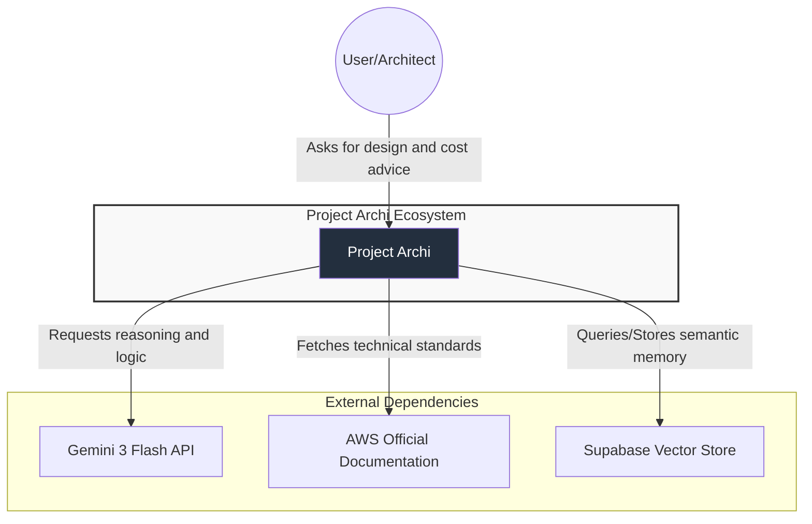

# C4 Model - Level 1: System Context

## 1. Description

**Project Archi** is an intelligent orchestration platform designed to provide automated architectural guidance. It allows users to design cloud infrastructures that adhere to the **AWS Well-Architected Framework** by leveraging Large Language Models (LLMs) and Retrieval-Augmented Generation (RAG).

## 2. System Context Diagram

This diagram shows the system as a "black box" and its relationship with external actors and third-party systems.

## 3. Elements

### A. Actors

* **User/Architect:** The primary user who interacts with the system to input technical requirements and receive architectural diagrams, cost estimations, and security audits.

### B. Internal Systems

* **Project Archi:** The core application responsible for orchestrating business logic, processing user requests, and coordinating external service calls to generate coherent technical responses.

### C. External Systems

* **Gemini 3 Flash API:** Provides high-speed natural language processing and logical reasoning capabilities for architectural decision-making.
* **AWS Documentation:** The authoritative source of truth used during the data ingestion phase to ensure advice is aligned with current AWS standards.
* **Supabase Vector Store:** A PostgreSQL database with `pgvector` used for storing and retrieving high-dimensional embeddings, enabling the system to maintain "technical memory" through RAG.

## 4. Primary Flow

1. The **User** submits a technical requirement or architectural query.
2. The **System** performs a semantic search in **Supabase** to retrieve relevant AWS context.
3. The **System** sends the combined context and user query to the **Gemini API**.
4. The **System** processes the structured response and delivers text, live diagrams (Mermaid.js), and architectural guidance back to the **User**.
