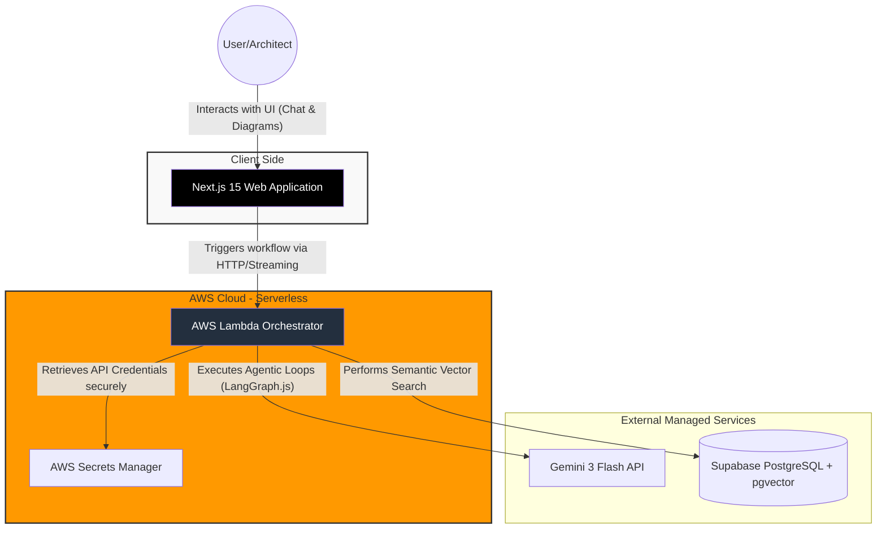

# C4 Model - Level 2: Container Diagram

## 1. Description

This level zooms into **Project Archi** to show the high-level technical building blocks (containers) that make up the system. It highlights the **Multi-Cloud Hybrid Serverless** architecture, separating the client-side interface from the serverless orchestration backend and external managed services.

## 2. Container Diagram

This diagram maps the interactions between the frontend, the serverless backend, and external data sources.

## 3. Elements

### A. Actors

* **User/Architect:** Interacts with the web application to request AWS architecture diagrams and validations.

### B. Internal Containers

* **Next.js 15 Web Application:** The frontend client utilizing React and TanStack Query v5 to manage state and render real-time Mermaid.js diagrams.
* **AWS Lambda Orchestrator:** The Node.js 24.x serverless backend running LangGraph.js. It manages stateful execution loops, handles data fetching, and validates AI outputs.
* **AWS Secrets Manager:** A secure vault used by the Lambda Orchestrator to retrieve API keys for Supabase and Gemini without exposing them in the codebase.

### C. External Systems

* **Gemini 3 Flash API:** The LLM engine providing the reasoning layer.
* **Supabase Vector Store:** The serverless-friendly PostgreSQL database acting as the RAG knowledge base.

## 4. Primary Flow

1. The **User** enters a prompt into the **Next.js Web Application**.
2. The **Web Application** makes an asynchronous API call to the **AWS Lambda Orchestrator**.
3. The **Lambda Orchestrator** securely fetches necessary API keys from **AWS Secrets Manager**.
4. The **Lambda Orchestrator** queries **Supabase** for architectural context and orchestrates a validation loop with **Gemini**.
5. The final validated response and Mermaid.js code are streamed back to the **Web Application** for rendering.
