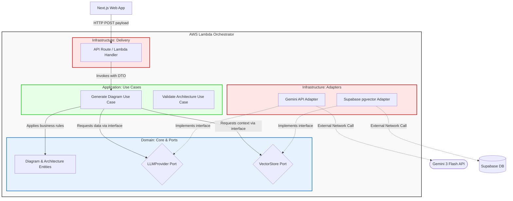

# C4 Model - Level 3: Component Diagram

## 1. Description

This level zooms specifically into the **AWS Lambda Orchestrator** container to reveal its internal components. It illustrates the implementation of the **Hexagonal Architecture (Ports and Adapters)**, demonstrating how the core domain logic is strictly isolated from external infrastructure and delivery mechanisms.

## 2. Component Diagram

This diagram shows how data enters through the delivery layer, is processed by use cases, and interacts with external services via abstract ports.

## 3. Elements

### A. External Triggers

* **Next.js Web App:** The external client that sends the initial HTTP request to the Lambda function.

### B. Internal Components (Hexagonal Layers)

* **Delivery Layer (Lambda Handler):** Parses incoming HTTP requests, validates the initial payload, and maps it to Data Transfer Objects (DTOs) for the Application layer.
* **Application Layer (Use Cases):** Contains the application-specific business rules (e.g., `GenerateDiagramUseCase`). It orchestrates the flow of data but does not know *how* data is fetched.
* **Domain Layer (Entities & Ports):** The pure core of the system. It contains the data structures (`Entities`) and the interfaces (`Ports` like `LLMProvider`) that define what the system needs from the outside world. It has zero external dependencies.
* **Adapter Layer:** Contains the specific implementations of the Ports. The `GeminiAdapter` translates system requests into Google API calls, and the `SupabaseAdapter` handles PostgreSQL queries.

### C. External Destinations

* **Gemini 3 Flash API & Supabase DB:** The actual third-party services called by the adapters.

## 4. Primary Flow

1. The **Lambda Handler** receives the payload from the Web App and triggers the **Generate Diagram Use Case**.
2. The **Use Case** queries the **VectorStore Port** for context.
3. The **Supabase Adapter** (implementing the port) fetches the data and returns it to the Use Case.
4. The **Use Case** combines the context and calls the **LLMProvider Port**.
5. The **Gemini Adapter** communicates with the Gemini API and returns the generated content.
6. The **Domain Entities** validate the structure of the response, and the Use Case returns the final result back through the Handler.
