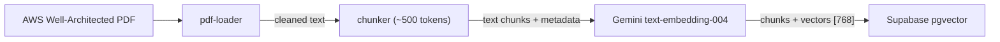
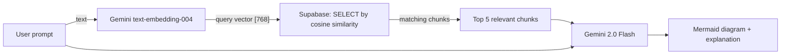
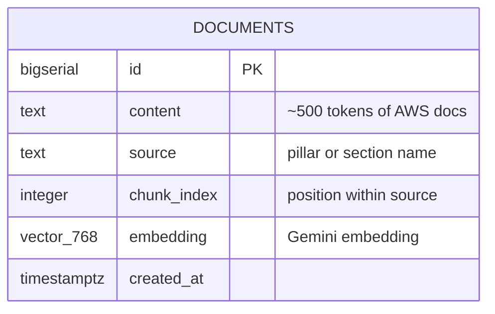

# RAG Data Flow

Two separate processes share the same Supabase `documents` table and the same Gemini embedding model (`text-embedding-004`).

## 1. Offline Ingestion (Phase 3 — run once)

**Trigger:** Manual — `npm run ingest` from `scripts/rag-ingestion/`.
**Frequency:** Once, or when AWS docs are updated.

---

## 2. Runtime Search (Phase 4+ — every user request)

**Trigger:** Every API request to the Lambda.
**Key constraint:** Must use the **same** embedding model for both ingestion and search — vectors from different models are incompatible.

---

## Data Model

Index: `IVFFlat` on `embedding` with `vector_cosine_ops` (32 lists).
